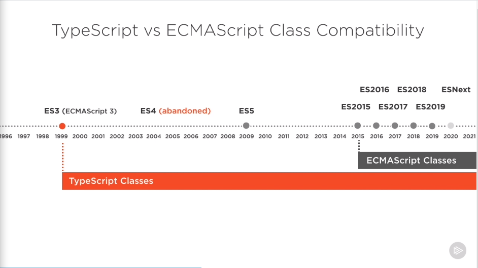
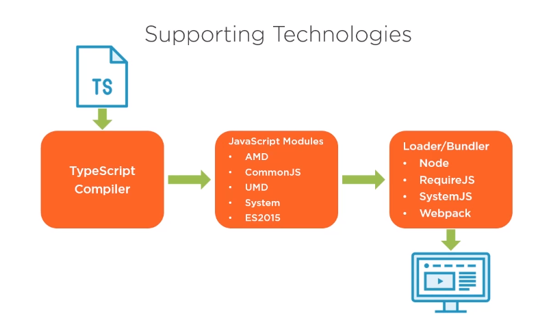

- [TypeScript](https://www.typescriptlang.org/)
    - TypeScript the Big Picture
        - How TypeScript Can Help
            - The problem with JavaScript

                The original design of JavaScript does fit for large scale applications. It helps in writing large application and TypeScript compiles to JavaScript.

            - Static Typing

                variables, parameters, return types, etc.

            - Organization support

                Making it easier to mange a large codebase:

                - classes

                    JavaScript added class support in 2015, but Classes in TypeScript code can be compile to JavaScript that is compatible back in 1999.
                    - 
                    

                - namespaces
                - modules
                - interfaces
            - Tooling Support
                1. Static type analysis
                2. many "instant" errors
                3. detect unused data / unreachable code
                4. source map — debug directly in TypeScript
        - "Hello World" in TypeScript
            - If you know how to write JavaScript Hello World, you should be good. Because valid JavaScript code is TypeScript code.
        - Write and Compile TypeScript
            - TypeScript file looks like this: `name_of_file.ts`
            - Compiler for TypeScript is called: `tsc`
        - Setting up your environment
            - what you need:
                1. An IDE that understand TypeScript
                2. tsc compiler
                    1. to set up tsc,  Node.js has it pre-installed
                    2. `npm install -g typescript`
                    3. to verify the installment, use `tsc -v` or `tsc -h`
            - TypeScript Project Configuration
                - when compile with tsc, you have the option like the version of the JavaScript, folder to store the compiled file and so on. 
                example:

                    ```
                    tsc --target ES2015 --outDir js basic.ts
                    // targeted version|output folder name|name of the file to compile
                    ```

                - To save your trouble, use a TypeScript config file
                Name the file: `tsconfig.json`

                    TypeScript Configuration File example:

                    ```tsx
                    {
                    	"compilerOptions": {
                    		"target": "es5",
                    		"outDir": "./js"
                    		"strict": true,
                    		"noUnusedLocals": true
                    	}
                    	"exclude":[
                    		"./js"
                    	]
                    }
                    ```

    - Getting Started

        [Course Github Link](https://github.com/bricewilson/TypeScript-Getting-Started/)

        - Installing TypeScript and Configuring a Project
            - Configuring Compiler Options and Glob Support in tsconfid.json
                - To create a default config file

                    ```tsx
                    tsc --init
                    ```

                    This will create a default tsconfig.json file with many compiler options commented out. You can choose which ones you wish to turn on or of by comment or uncomment the options. 

                - `!` is the none-null assertion mark to depress known html element but show up as an error in tsc.

                    ```tsx
                    function startGame(){
                        // starting a new game
                        var messageElement = document.getElementById('message');
                        messageElement!.innerText = 'Welcome to MultiMath! Starting new game...';
                    }

                    document.getElementById('startGame')!.addEventListener('click', startGame);
                    ```

                - Configuration Inheritance and Glob Support in tsconfig.json
                    - tsconfig.json uder `app` folder

                        ```tsx
                        {
                            "extends": "../tsconfig.base",
                            "compilerOptions": {
                                "removeComments": true
                            },
                            "include": [
                                "./**/*"
                            ]
                        }
                        ```

                    - tsconfig.base.json file is under the root folder of the project

                        ```tsx
                        {
                          "compilerOptions": {
                            /* Visit https://aka.ms/tsconfig.json to read more about this file */
                            /* Basic Options */
                            // "incremental": true,                         /* Enable incremental compilation */
                            "target": "es5", /* Specify ECMAScript target version: 'ES3' (default), 'ES5', 'ES2015', 'ES2016', 'ES2017', 'ES2018', 'ES2019', 'ES2020', 'ES2021', or 'ESNEXT'. */
                            // "module": "commonjs", /* Specify module code generation: 'none', 'commonjs', 'amd', 'system', 'umd', 'es2015', 'es2020', or 'ESNext'. */
                            // "lib": [],                                   /* Specify library files to be included in the compilation. */
                            // "allowJs": true,                             /* Allow javascript files to be compiled. */
                            // "checkJs": true,                             /* Report errors in .js files. */
                            // "jsx": "preserve",                           /* Specify JSX code generation: 'preserve', 'react-native', 'react', 'react-jsx' or 'react-jsxdev'. */
                            // "declaration": true,                         /* Generates corresponding '.d.ts' file. */
                            // "declarationMap": true,                      /* Generates a sourcemap for each corresponding '.d.ts' file. */
                            "sourceMap": true,                           /* Generates corresponding '.map' file. */
                            // "outFile": "./",                             /* Concatenate and emit output to single file. */
                            "outDir": "js",                              /* Redirect output structure to the directory. */
                            // "rootDir": "./",                             /* Specify the root directory of input files. Use to control the output directory structure with --outDir. */
                            // "composite": true,                           /* Enable project compilation */
                            // "tsBuildInfoFile": "./",                     /* Specify file to store incremental compilation information */
                            // "removeComments": true,                      /* Do not emit comments to output. */
                            // "noEmit": true,                              /* Do not emit outputs. */
                            // "importHelpers": true,                       /* Import emit helpers from 'tslib'. */
                            // "downlevelIteration": true,                  /* Provide full support for iterables in 'for-of', spread, and destructuring when targeting 'ES5' or 'ES3'. */
                            // "isolatedModules": true,                     /* Transpile each file as a separate module (similar to 'ts.transpileModule'). */
                            /* Strict Type-Checking Options */
                            "strict": true, /* Enable all strict type-checking options. */
                            // "noImplicitAny": true,                       /* Raise error on expressions and declarations with an implied 'any' type. */
                            // "strictNullChecks": true,                    /* Enable strict null checks. */
                            // "strictFunctionTypes": true,                 /* Enable strict checking of function types. */
                            // "strictBindCallApply": true,                 /* Enable strict 'bind', 'call', and 'apply' methods on functions. */
                            // "strictPropertyInitialization": true,        /* Enable strict checking of property initialization in classes. */
                            // "noImplicitThis": true,                      /* Raise error on 'this' expressions with an implied 'any' type. */
                            // "alwaysStrict": true,                        /* Parse in strict mode and emit "use strict" for each source file. */
                            /* Additional Checks */
                            // "noUnusedLocals": true,                      /* Report errors on unused locals. */
                            // "noUnusedParameters": true,                  /* Report errors on unused parameters. */
                            // "noImplicitReturns": true,                   /* Report error when not all code paths in function return a value. */
                            // "noFallthroughCasesInSwitch": true,          /* Report errors for fallthrough cases in switch statement. */
                            // "noUncheckedIndexedAccess": true,            /* Include 'undefined' in index signature results */
                            // "noImplicitOverride": true,                  /* Ensure overriding members in derived classes are marked with an 'override' modifier. */
                            // "noPropertyAccessFromIndexSignature": true,  /* Require undeclared properties from index signatures to use element accesses. */
                            /* Module Resolution Options */
                            // "moduleResolution": "node",                  /* Specify module resolution strategy: 'node' (Node.js) or 'classic' (TypeScript pre-1.6). */
                            // "baseUrl": "./",                             /* Base directory to resolve non-absolute module names. */
                            // "paths": {},                                 /* A series of entries which re-map imports to lookup locations relative to the 'baseUrl'. */
                            // "rootDirs": [],                              /* List of root folders whose combined content represents the structure of the project at runtime. */
                            // "typeRoots": [],                             /* List of folders to include type definitions from. */
                            // "types": [],                                 /* Type declaration files to be included in compilation. */
                            // "allowSyntheticDefaultImports": true,        /* Allow default imports from modules with no default export. This does not affect code emit, just typechecking. */
                            // "esModuleInterop": true, /* Enables emit interoperability between CommonJS and ES Modules via creation of namespace objects for all imports. Implies 'allowSyntheticDefaultImports'. */
                            // "preserveSymlinks": true,                    /* Do not resolve the real path of symlinks. */
                            // "allowUmdGlobalAccess": true,                /* Allow accessing UMD globals from modules. */
                            /* Source Map Options */
                            // "sourceRoot": "",                            /* Specify the location where debugger should locate TypeScript files instead of source locations. */
                            // "mapRoot": "",                               /* Specify the location where debugger should locate map files instead of generated locations. */
                            // "inlineSourceMap": true,                     /* Emit a single file with source maps instead of having a separate file. */
                            // "inlineSources": true,                       /* Emit the source alongside the sourcemaps within a single file; requires '--inlineSourceMap' or '--sourceMap' to be set. */
                            /* Experimental Options */
                            // "experimentalDecorators": true,              /* Enables experimental support for ES7 decorators. */
                            // "emitDecoratorMetadata": true,               /* Enables experimental support for emitting type metadata for decorators. */
                            /* Advanced Options */
                            "skipLibCheck": true, /* Skip type checking of declaration files. */
                            "forceConsistentCasingInFileNames": true, /* Disallow inconsistently-cased references to the same file. */
                            "watch": true,
                          }
                        }
                        ```

                    Now if we go the `app` folder and do a `tsc` , the compiler will inherit all the option inside the base file and compile. 

                - Compile using webpack
                    - webpack config file

                        ```tsx
                        module.exports = {
                          entry: './app/app.ts',
                          devtool: 'inline-source-map',
                          mode: 'development',
                          module: {
                            rules: [
                              {
                                test: /\.tsx?$/,
                                use: 'ts-loader',
                                exclude: /node_modules/
                              }
                            ]
                          },
                          resolve: {
                            extensions: [ '.tsx', '.ts', '.js' ]
                          },
                          output: {
                            filename: 'bundle.js'
                          },
                          devServer: {
                            inline: false
                          }
                        };
                        ```

                    - Since webpack is going to pack the html and everything into a bundle.js and start the server, we can just point the script to bundle.js instead of app.js.

                        ```tsx
                        <html>
                        <head lang="en">
                            <meta charset="UTF-8">
                            <link rel="stylesheet" href="css/united.bootstrap.min.css">
                            <link rel="icon" type="image/png" href="favicon.png">
                            <title>MultiMath</title>
                        </head>
                        <body>
                            
                            <nav class="navbar navbar-default">
                                <div class="container-fluid">
                                    <div class="navbar-header">
                                        <span class="navbar-brand">MultiMath</span>
                                    </div>
                                </div>
                            </nav>
                            
                            <div class="form-horizontal" id="nameform">
                                <div class="form-group">
                                    <label for="playername" class="col-sm-2 control-label">Player Name</label>
                                    <div class="col-sm-2">
                                        <input type="text" class="form-control" id="playername" size="20" placeholder="Player Name" />
                                    </div>
                                </div>
                                
                                <div class="form-group">
                                    <label for="factor" class="col-sm-2 control-label">Factor</label>
                                    <div class="col-sm-2">
                                        <input type="text" class="form-control" id="factor" size="20" value="5" placeholder="Factor" />
                                    </div>
                                </div>

                                <div class="form-group">
                                    <label for="problemCount" class="col-sm-2 control-label">Number of Problems</label>
                                    <div class="col-sm-2">
                                        <input type="text" class="form-control" id="problemCount" size="20" placeholder="Number of Problems" />
                                    </div>
                                </div>

                                <div class="form-group">
                                    <div class="col-sm-offset-2 col-sm-10">
                                        <button class="btn btn-primary" id="startGame">Start Game</button>
                                        <button class="btn btn-success" id="calculate" disabled>Calculate Score</button>
                                    </div>
                                </div>
                            </div>
                            
                            <div class="form-horizontal" id="game"></div>
                            
                            <div class="col-sm-offset-2 col-sm-10" id="scores">
                                <h2>Scoreboard</h2>
                                <h4>No scores yet</h4>
                            </div>

                            <div class="col-sm-offset-2 col-sm-10" id="messages"></div>
                            
                            <!-- add script tags here -->
                            <script src="bundle.js"></script>

                        </body>
                        </html>
                        ```

        - Taking advantage of the built-in types
            - Basic TypeScript Types
                - Boolean
                - Number
                - String
                - Array
                - Enum
            - Declarations with let and const

                valid javascript:

                ```jsx
                console.log(someString);
                var someString = 'Hello World'
                ```

                recommended and valid in TypeScript

                ```jsx
                let someString = 'Hello World';
                console.log(someString);

                const someString = 'Hello World';
                console.log(someString);
                ```

                NOTE:

                The declaration should happen before using the variable like many other programming languages. 

            - Type Annotations and Type Inference

                ```jsx
                let x: string = 'I will forever be a string'
                x = 42; // this will give an error

                // you don't have to use type annotation, 
                // but is recommended.
                // take the example below
                let z = GetSomeValue(); 

                // it is hard for people to know 
                // what is the return type of the function
                // instead, you can use a type annotation
                let z: number = GetSomeValue();
                ```

                Takeaway: no matter you use type annotation or not, be consistent is the key. Communicate with your team member and decide whether to use type annotation or not. 

            - Additional Built-in Types
                - Void
                    - absence of a type, mostly used for functions that does not return a type
                - Null
                - Undefined
                - Never
                    - Value that never occur, example (a function has a infinite loop, or exception, the return value of that function will be Never).
                - Any
                    - to Opt-out the type annotation, you can assign anything type that is an Any.
            - Union Types and the —strictNullChecks Compiler Option
                - Union Types

                    ```jsx
                    // declaration below will be ok with either 
                    // type of number or string for assignment
                    let someValue: number | string;

                    someValue = 42; // this is ok

                    someValue = 'Hello World'; // this is ok

                    someValue = true; // this will give an error
                    ```

                - Using the —strictNullChecks Compiler Option

                    ```jsx
                    let basicString: string;
                    basicString = null;
                    basicString = undefined;

                    let nullableString: string | null
                    ```

                - Type Assertions

                    ```tsx
                    let value: any = 5;

                    let fixedString: string = (<number>value).toFixed(4);
                    console.log(fixedString); // 5.0000

                    let fixedString: string = (value as number).toFixed(4);
                    console.log(fixedString); // 5.0000
                    ```

        - Writing Better Functions with TypeScript
            - Adding Type Annotation Functions

                ```tsx
                //JavaScript
                function dullFunc(value1, value2){
                	return "I'm boring and different. Don't be like me.";
                }

                //TypeScript
                function funFunc(score: number, message?:string):string{
                	return "I've got personality and I'm helpful! Be like me!";
                }
                ```

                - `?` mark means optional parameters.
                - All parameters in TypeScript are considered required.
                - You will get an error if you pass in less or more parameters than what the function needs.
            - Using the —noImplicitAny Compiler Option

                So you will know you forgot to write type annotation for you function parameters. 

            - Default-Initialized Parameters

                ```tsx
                // This function below prints out Good morning by default
                function sendGreeting(greeting: string = 'Good morning!'): void{
                	console.log(greeting);
                }

                sendGreeting(); // Good morning!
                sendGreeting('Good Afternoon!'); // Good afternoon!

                ```

                Note: the `=` sign set the parameter greeting as optional, and give a default value of 'Good morning!'.

            - Anatomy of an Arrow Function
                - `=>` Arrow Function is basically lambda in other programming language that allows anonymous method.

                    ```tsx
                    // arrow function example
                    let squareit = x => x * x;
                    let result = squareit(4); // 16

                    // two parameters
                    let adder = (a, b) => a + b;
                    let sum = adder(2, 3); // 5

                    // no parameters
                    let greeting = () => console.log('Hello World!');
                    greeting(); // Hello World!

                    // filter an array
                    let scores: number[] = [70, 125, 85, 110];
                    let highScores: number[];
                    highScores = scores.filter((element, index, array) => {
                    	if (element > 100){
                    		return true;
                    	}
                    })
                    ```

            - Converting a Traditional Function to an Arrow Function

                ```tsx
                // normal function
                function logMessage(message: string): void{
                	console.log(message);
                }

                // convert to a Arrow function
                const logMessage = (message: string) => console.log(message);
                ```

            - Take Advantage of Function Types

                ```tsx
                function logError(err: string): void {
                	console.error(err);
                }
                ```

        - Creating and Using Custom Types
            - Interfaces vs classes
                - Interfaces
                    - Define a new type
                    - Properties(signatures)
                    - Methods(signatures)
                    - Cannot be instantiated
                - Classes
                    - Define a new type
                    - Properties(with implementation)
                    - Methods(with implementation)
                    - Can be instantiated
            - Creating an Interface

                ```tsx
                interface Employee {
                	name: string;
                	title:string;
                }

                interface Manager extends Employee{
                	department: string
                	numOfEmployees: number;
                	scheduleMeeting: (topic:string)=>void;
                }
                ```

            - TypeScript's Structural Type System

                ```tsx
                interface Employee{
                	name: string;
                	title:string;
                }

                let developer = {
                	name: 'Michelle';
                	title: 'Senior TypeScript Developer';
                	editor: 'Visual Studio Code'
                }

                let newEmployee: Employee = developer;
                // this is ok because developer 
                // fits the requirement of a Employee. 
                ```

            - Class Members
                - Method Implementations
                - Property implementations
                - Accessors(getters and setters)
                - Access modifiers
                    - Public
                    - Private
                    - Protected

                **example**:

                ```tsx
                class DeveloperP{
                	departemnt: string;
                	private_title: string;
                	get title(): string{
                		return this._title;
                	}
                	set title(newTitle:string){
                		this._title = newTitle.toUpperCase();
                	}
                	documentRequirements(requirements:string):void{
                		console.log(requirements);
                	}
                }
                ```

                - Static class Members
            - Class Static Members

                ```tsx
                class WebDeveloper extends Developer{
                	static jobDescription: string = 'Build cool things!';
                	static logFavoriteProtocol(){
                		console.log('HTTPS, of course!');
                	}
                	logJobDescription(): void{
                		console.log(WebDeveloper.jobDescription);
                	}
                }

                WebDeveloper.logFavoriteProtocol();
                ```

                static member is call using the class name instead of this, because the member existed on a class. 

            - Constructors

                ```tsx
                class Developer{
                	constructor() {
                		console.log('Creating a new developer.');
                	}
                }

                class WebDeveloper extends Developer{
                	readonly favoriteEditor: string;
                	constructor(editor:string){
                		super();
                		this.favoriteEditor = editor;
                	}
                }
                ```

        - Creating and Consuming Modules
            - Why use modules?
                - Encapsulation
                - Resusability
                - Create higher level abstraction
            - Supporting Technologies

               

            - Exporting and Importing
                - Export

                    ```tsx
                    // two ways of exporting modules

                    // person.ts
                    export interface Person{}

                    export function hireDeveloper(): void {}

                    export default class Employee{}

                    // Export multiple modules
                    export { Person, hireDeveloper, Employee as StaffMemmber);

                    ```

                - Import

                    ```tsx
                    // player.ts

                    // import multiple items
                    import {Person, hireDeveloper} from '/person';
                    let human: Person;

                    // import default item
                    import Worker from '/person';
                    let engineer: Worker = new Worker();

                    // import item with alias
                    import {StaffMember as CoWorker} from './person';
                    let emp: CoWorker = new CoWorker();

                    // import entire module 
                    import * as HR from './person';
                    HR.hireDeveloper();
                    ```

            - Relative vs. Non-relative Imports

                ```tsx
                // relative imports
                import { Laptop } from '/hardware';
                import { Dveloper } from './person';
                import { NewHire } from './HR/recruting';

                //non-relative imports
                import * as $ from 'jquery';
                import * as lodash from 'lodash';
                ```

                 Notes: In general, it is recommended to use relative imports for your own module, and use non-relative imports for third party modules.

            - Module Resolution Strategies
                - Compiler Options:

                    `tsc --moduleResolution Classic | Node`

                - Classic
                    - Default when emitting AMD, UMD, System, or ES2015 modules
                    - Simple
                    - Less Configurable
                - Node
                    - Default when emitting CommonJS modules
                    - Closely mirrors Node module resolution
                    - More configurable
                - Module Resolution Examples
                    - Classic
                        - Resolving Classic Relative Imports

                            ```tsx
                            // File: /Source/Multimath/player.ts
                            import { Developer } from './person';

                            // TypeScript is going to try find the modules under
                            /Source/MultiMath/person.ts
                            /Source/MultiMath/person.d.ts
                            ```

                        - Resolving Classic Non-relative Imports

                            ```tsx
                            // File: /Source/Multimath/player.ts
                            import { Developer } from './person';

                            // TypeScript is going to try find the modules under
                            /Source/MultiMath/person.ts
                            /Source/MultiMath/person.d.ts
                            /Source/person.ts
                            /Source/person.d.ts
                            // (continue searching up the direactory tree)
                            ```

                    - Node
                        - Resolving Node Relative Imports

                            ```tsx
                            // File: /Source/Multimath/player.ts
                            import { Developer } from './person';

                            // TypeScript is going to try find the modules under
                            /Source/MultiMath/person.ts
                            /Source/MultiMath/person.tsx
                            /Source/MultiMath/person.d.ts

                            // if none of the above is found
                            // it will try to find 
                            /Source/MultiMath/person/package.json(with "type" property)

                            // otherwise, it will try to find:
                            /Source/MultiMath/person/index.ts
                            /Source/MultiMath/person/index.tsx
                            /Source/MultiMath/person/index.d.ts
                            ```

                        - Resolving Node Non-relative Imports

                            ```tsx
                            // File: /Source/Multimath/player.ts
                            import { Developer } from './person';

                            // TypeScript is going to try find the modules under
                            /Source/MultiMath/node_modules/person.ts
                            /Source/MultiMath/node_modules/person.tsx
                            /Source/MultiMath/node_modules/person.d.ts

                            // if none of the above is found
                            // it will try to find 
                            /Source/MultiMath/node_modules/person/package.json(with "type" property)

                            // if not found, it will then try to find:
                            /Source/MultiMath/node_modules/@types/person.d.ts

                            // then
                            /Source/MultiMath/node_modules/person/index.ts
                            /Source/MultiMath/node_modules/person/index.tsx
                            /Source/MultiMath/node_modules/person/index.d.ts

                            // then it will move up a level of directory
                            /Source/node_modules/person.ts
                            /Source/node_modules/person.tsx
                            /Source/node_modules/person.d.ts

                            /Source/node.modules/person/package.json (with "types" property)
                            /Source/node_modules/@types/person.d.ts
                            /Source/node_modules/person/index.ts(index.tsx, index.d.ts)
                            // (continue searching up the direactory tree)
                            ```

        - Being More Productive with Type Declaration Files
            - What Are Type Declaration Files?
                - TypeScript wrapper for JavaScript libraries
                    - Types for variables, functions, etc.
                    - Define valid property names
                    - Define function parameters
                    - And much more!
                - Development-time tool
                - Filenames end with `.d.ts`
                - Available for thousands of libraries
            - Obtaining Type Declaration Files
                - Definitely Typed
                    - Github repo containing thousands of type declaration files
                    - Declaration files often maintained independent of related JavaScript library
                    - Source for installation utilities
            - Installing Type Declaration Files
                - Installed with npm
                - Packages installed from @types/\<name>
                - Sourced from the Definitely Typed repo