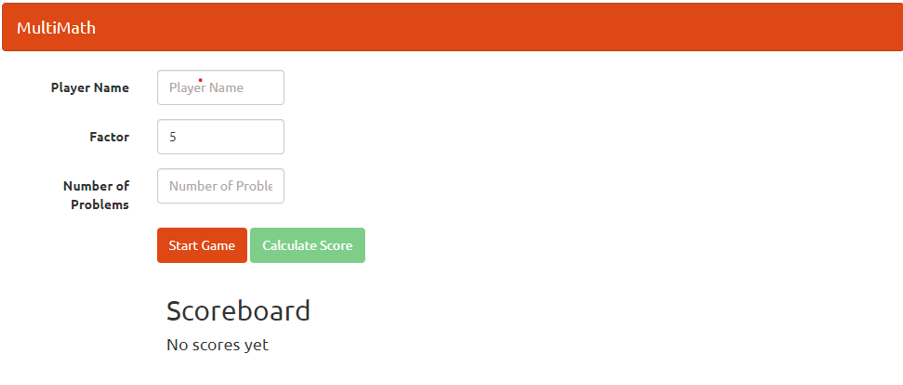

# TypeScript-Getting-Started

### Attention!!: This repo was meant for my own learning purpose. If you want to practice on your own, I recommend you go to the original repo [here](https://github.com/bricewilson/TypeScript-Getting-Started/).

---

### Notes about this repo:

- This is the repository for Pluralsight course titled *[TypeScript: Getting Started](https://app.pluralsight.com/library/courses/typescript-getting-started/table-of-contents)*. The Course is taught by [Brice Wilson](https://github.com/bricewilson).
- The *`main`* branch contains code for the practice MultiMath application from the course.

### My own notes from the course:

- This is my [*personal notes*](https://github.com/jayzhou125/TypeScript-Getting-Started/tree/main/PersonalNotes) for learning TypeScript from the course, feel free to check it out! 

### Screenshots of the Application:
- StartPage

    

- GameResult
    
    